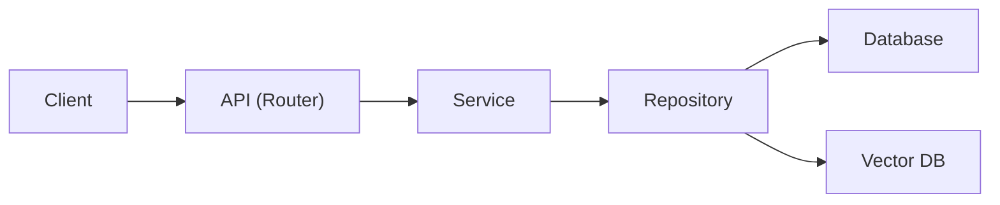

# TraceBoard AI

> TraceBoard AI는 FastAPI와 PostgreSQL을 기반으로 구현한 개인 학습 프로젝트입니다.

게시글 데이터를 기반으로 **RAG(Retrieval-Augmented Generation) 파이프라인**을 직접 구현하며,
백엔드 시스템과 AI 기능이 연결되는 전체 흐름을 학습하는 것을 목표로 했습니다.

---

## Key Results

- **PostgreSQL Full Text Search 적용**
  - 검색 속도: `122ms → 6ms`

- **created_at 인덱스 설계**
  - 목록 조회 성능: `5ms → 1ms`

- **End-to-End RAG Pipeline 구현**
  - 게시글 저장 → 임베딩 → 벡터 검색 → LLM 응답 생성

---

## Why I Built This

LLM API 호출에 그치지 않고,
데이터 저장부터 **Retrieval → Context 구성 → AI 응답 생성**까지 이어지는
백엔드 기반 RAG 흐름을 직접 구현해보고 싶었습니다.

이를 위해 REST API, 비동기 처리, PostgreSQL Full Text Search,
Vector DB를 하나의 시스템으로 연결해 RAG 파이프라인을 구성했습니다.

---

## Architecture

Layered Architecture를 적용해
HTTP 요청 처리, 비즈니스 로직, 데이터 접근 계층을 분리했습니다.



| Layer | Responsibility |
| --- | --- |
| Router | HTTP 요청 / 응답 처리 |
| Service | 비즈니스 로직 및 RAG 흐름 제어 |
| Repository | PostgreSQL / Vector DB 접근 |
| BackgroundTasks | 게시글 생성/수정/삭제 후 비동기 인덱스 동기화 |

자세한 구조는 `docs/architecture.md` 참고

---

## Key Features

- 게시글 CRUD API
- 게시글 생성/수정/삭제 후 자동 청크 인덱스 동기화
- Recursive chunking + overlap 기반 청크 단위 임베딩 및 벡터 저장
- RAG 기반 AI 질의응답
- 답변 근거 Source 추적(metadata 반환)
- PostgreSQL Full Text Search 기반 검색

---

## Implemented

- FastAPI 기반 REST API 설계
- SQLAlchemy AsyncSession 기반 비동기 DB 처리
- Service / Repository 계층 분리
- PostgreSQL Index 설계
- `EXPLAIN ANALYZE` 기반 쿼리 성능 검증

---

## How It Works

### Indexing Flow

```text
Create/Update Post
      │
      ▼
PostgreSQL 저장
      │
      ▼
BackgroundTasks 실행
      │
      ▼
Recursive Chunking + Overlap
      │
      ▼
Text Embedding
      │
      ▼
Chroma Vector DB 청크 저장
```

### Query Flow

```text
User Question
      │
      ▼
Vector Search
      │
      ▼
Relevant Context 생성
      │
      ▼
Gemini LLM
      │
      ▼
Answer + Sources 반환
```

---

## Tech Stack

### Backend

- FastAPI
- SQLAlchemy (AsyncSession)
- Pydantic v2

### Database

- PostgreSQL (Supabase)

### AI / Data

- Chroma
- Gemini
- RAG (Retrieval-Augmented Generation)

---

## Folder Structure

```text
backend/app/
├── api/v1/
├── core/
├── models/
├── repositories/
├── schemas/
├── services/
└── main.py
```

---

## API

| Method | Endpoint | Description |
| :--- | :--- | :--- |
| POST | `/posts` | 게시글 생성 |
| GET | `/posts` | 게시글 목록 조회 |
| GET | `/posts/search` | Full Text Search |
| GET | `/posts/{post_id}` | 게시글 상세 조회 |
| PUT | `/posts/{post_id}` | 게시글 수정 |
| DELETE | `/posts/{post_id}` | 게시글 삭제 |
| POST | `/ai/index-post/{post_id}` | 게시글 수동 인덱싱 |
| POST | `/ai/query` | RAG 질의응답 |

> 게시글 생성/수정 시 청크 인덱싱이, 삭제 시 청크 인덱스 삭제가 BackgroundTasks를 통해 자동 실행됩니다.

자세한 API 명세는 `docs/api_spec.md` 참고

---

## Key Design Decisions

### RAG

단순 LLM 호출이 아니라,
저장된 데이터에 근거한 응답 생성을 위해 RAG 구조를 선택했습니다.

### Layered Architecture

Router / Service / Repository 계층으로 책임을 분리해
비즈니스 로직과 데이터 접근 영역을 구분했습니다.

### Vector DB

원본 데이터는 PostgreSQL에 저장하고,
의미 기반 검색은 Chroma에 위임했습니다.

### DB Indexing

현재 실제 사용되는 조회 패턴을 기준으로 인덱스를 설계했습니다.

추후 사용자별 조회 기능이 추가되면
`(author_id, created_at)` 복합 인덱스 도입을 고려할 예정입니다.

---

## Technical Notes & Trade-offs

### BackgroundTasks

- 임베딩 작업을 백그라운드 처리
- Request Scope와 별도의 DB Session 생성
- 향후 Celery + Redis Worker 구조로 확장 예정

### Vector DB

- MVP 단계에서는 Chroma 선택
- 대규모 환경에서는 Pinecone 등으로 전환 고려

### DB Indexing

- `created_at` 인덱스 추가
- `Seq Scan + Sort` → `Index Scan`
- `EXPLAIN ANALYZE` 기반 검증

### Full Text Search

기존 `ILIKE '%keyword%'` 검색 대신
PostgreSQL Full Text Search(GIN Index 기반)를 적용해
인덱스를 활용하는 검색 구조로 변경했습니다.

---

## Future Work

- [ ] JWT 인증
- [ ] 사용자별 게시글 조회
- [ ] Celery + Redis Worker
- [ ] 문서 업로드 기능
- [x] Chunking 기반 RAG 개선
- [ ] Retrieval Quality 평가
