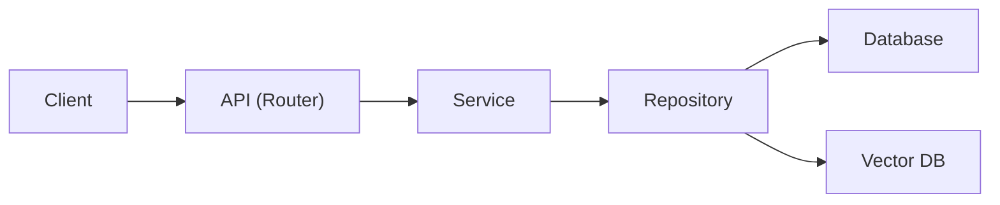

# TraceBoard AI

**게시글 데이터를 검색 가능한 지식으로 바꾸는 RAG 백엔드 파이프라인 — 개인 학습 프로젝트**

FastAPI

PostgreSQL

Python

Chroma

Gemini

TraceBoard AI는 FastAPI와 PostgreSQL을 기반으로 구현한 개인 학습용 프로젝트입니다.
게시글 데이터를 기반으로 RAG 검색과 AI 질의응답 흐름을 직접 구현하고,
DB 인덱싱과 검색 성능 개선까지 함께 실습해보는 것을 목표로 했습니다.

**Key Results**

> • PostgreSQL Full Text Search 도입으로 게시글 검색 속도 **122ms → 6ms**로 개선
• `created_at` 인덱스 설계로 목록 조회 쿼리 **5ms → 1ms**로 개선
• 게시글 저장부터 임베딩, 벡터 검색, LLM 응답까지 이어지는 RAG 파이프라인을 end-to-end로 구현
> 

---

## Why I Built This

AI 기능을 단순히 붙여보는 데서 끝내지 않고, 백엔드 구조와 데이터 흐름까지 함께 이해하기 위해 시작했습니다.
데이터가 저장되고, 검색되고, AI 응답으로 이어지는 흐름을 처음부터 끝까지 직접 구현해보고 싶었습니다.

---

## Architecture

Layered Architecture를 적용해 HTTP 요청 처리, 비즈니스 로직, 데이터 접근을 계층별로 분리했습니다.



- **Router**: HTTP 요청/응답 처리
- **Service**: 비즈니스 로직과 RAG 흐름 제어
- **Repository**: PostgreSQL / Vector DB 접근
- **BackgroundTasks**: 게시글 저장 후 비동기 인덱싱 트리거

> 자세한 구조는 `docs/architecture.md` 참고
> 

---

## Key Features

- **게시글 CRUD API** — 작성자와 연관된 게시글 생성 / 조회 / 수정 / 삭제
- **비동기 자동 인덱싱** — 게시글 생성 시 백그라운드로 임베딩 및 벡터 저장
- **RAG 기반 질의응답** — Chroma 벡터 검색 결과를 Gemini에 전달해 근거 기반 답변 생성
- **Source 추적** — 답변과 함께 근거가 된 게시글 metadata 반환
- **Full Text Search** — PostgreSQL 기반 게시글 검색

---

## Implemented

- FastAPI 기반 REST API 설계
- SQLAlchemy AsyncSession으로 비동기 DB 처리 구현
- Service / Repository 계층 분리
- 실제 쿼리 패턴 기반 인덱스 설계 및 `EXPLAIN ANALYZE` 검증

---

## How It Works

### Indexing Flow

1. 게시글 생성 요청이 들어온다
2. PostgreSQL에 게시글이 저장된다
3. 저장 성공 후 백그라운드 작업으로 인덱싱을 등록한다
4. 게시글 내용을 임베딩한다
5. Vector DB(Chroma)에 metadata(`post_id`, `title`, `content`)와 함께 저장한다

### Query Flow

1. 사용자가 질문을 입력한다
2. Vector DB에서 관련 게시글을 검색한다
3. 검색 결과를 context로 변환한다
4. Gemini LLM에 context와 질문을 전달한다
5. 답변과 source를 함께 반환한다

---

## Tech Stack

**Backend**

- FastAPI
- SQLAlchemy (AsyncSession)
- Pydantic v2

**Database**

- PostgreSQL (Supabase)

**AI / Data**

- Vector DB: Chroma
- LLM: Gemini
- Pipeline: RAG (Retrieval-Augmented Generation)

---

## Folder Structure

```
backend/app/
├── api/v1/          # API 엔드포인트
├── core/            # 설정 및 DB 연결
├── models/          # DB 모델
├── schemas/         # 요청/응답 스키마
├── repositories/    # 데이터 접근 계층
├── services/        # 비즈니스 로직 (RAG 포함)
└── main.py          # 앱 진입점
```

---

## API

| Method | Endpoint | Description |
| --- | --- | --- |
| `POST` | `/posts` | 게시글 생성 |
| `GET` | `/posts` | 게시글 목록 조회 |
| `GET` | `/posts/search` | Full Text Search 기반 게시글 검색 |
| `GET` | `/posts/{post_id}` | 게시글 상세 조회 |
| `PUT` | `/posts/{post_id}` | 게시글 수정 |
| `DELETE` | `/posts/{post_id}` | 게시글 삭제 |
| `POST` | `/ai/index-post/{post_id}` | 특정 게시글 수동 인덱싱 |
| `POST` | `/ai/query` | RAG 기반 AI 질의응답 |

> `/ai/index-post`는 게시글 생성 API 호출 시 백그라운드 태스크를 통해 자동으로 트리거되도록 설계했습니다.
전체 엔드포인트와 데이터 스키마는 `docs/api_spec.md` 참고.
> 

---

## Key Design Decisions

### 1. RAG 구조 선택

단순 LLM 응답이 아니라 저장된 데이터에 근거한 응답을 만들고 싶어서 RAG 구조를 선택했습니다.

### 2. Layered Architecture

Router / Service / Repository로 책임을 나누면서, 변하는 부분(비즈니스 로직)과 변하지 않는 부분(데이터 접근)을 분리해보고 싶었습니다.

### 3. Vector DB 분리

원본 데이터는 PostgreSQL에, 의미 기반 검색은 Vector DB에 맡기는 방식으로 역할을 나눴습니다.

### 4. 현재 사용되는 쿼리 기준의 인덱싱

로그인/사용자별 조회 기능이 추가되면 `author_id`, `created_at` 복합 인덱스 등이 필요해지겠지만,
아직 해당 기능이 없는 시점에서는 실제로 실행되는 목록 조회·검색 쿼리에만 인덱스를 적용했습니다.

---

## Technical Notes & Trade-offs

- **BackgroundTasks**: 무거운 임베딩 작업을 백그라운드로 분리했고, 요청 스코프와 별도의 DB 세션을 생성해 안정성을 확보했습니다. 서버 재시작 시 작업이 유실될 수 있어 향후 Celery + Redis 도입을 고려하고 있습니다.
- **Vector DB**: MVP 단계에서 빠르게 실험하기 위해 Chroma를 선택했고, 데이터 규모가 커지면 Pinecone 전환도 검토하고 있습니다.
- **DB Indexing**: 목록 조회 패턴(`ORDER BY created_at DESC LIMIT N`)을 기준으로 `created_at` 인덱스를 추가했고, `EXPLAIN ANALYZE`로 확인한 결과 실행 계획이 `Seq Scan + Sort`에서 `Index Scan`으로 바뀌었습니다.
- **Full Text Search**: 기존 `ILIKE '%keyword%'` 방식은 인덱스를 활용하지 못해 전체 텍스트를 순차적으로 훑는 구조였는데, PostgreSQL Full Text Search(GIN 인덱스 기반)로 전환하면서 검색 방식 자체를 바꿨습니다.

---

## Development Status (Future)

- 로그인 / JWT 인증
- 사용자 기반 게시글 조회
- Celery + Redis 기반 워커 전환
- 문서 업로드 기능
- Chunking 기반 RAG 개선
- Retrieval quality 평가 체계 추가