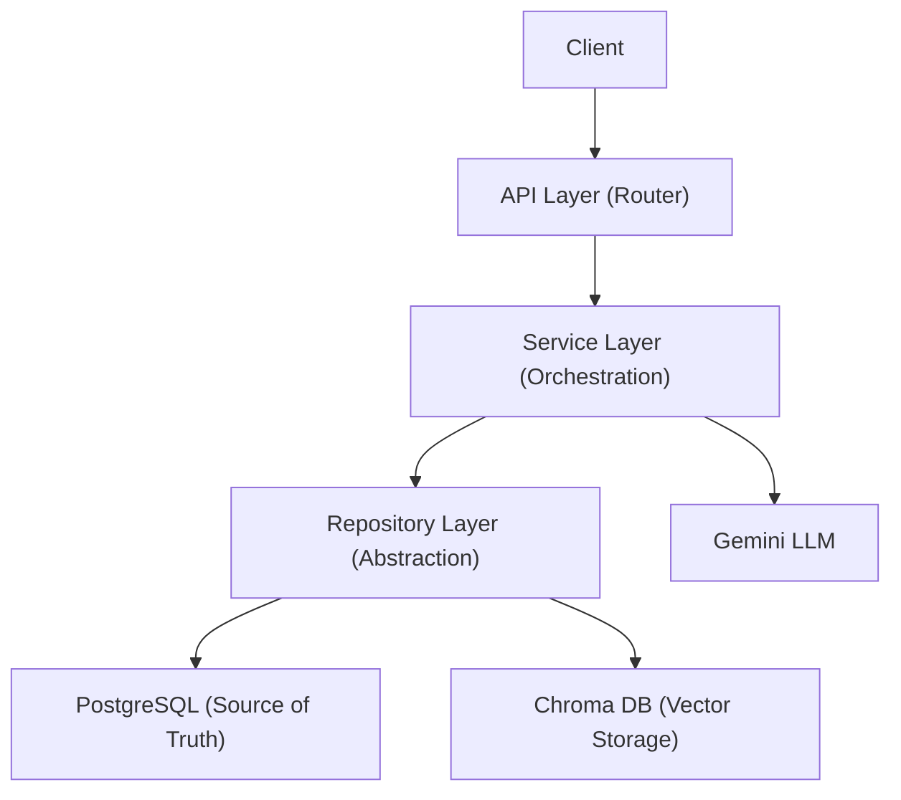

# Architecture Design

## 1. Overview (Architecture Philosophy)

TraceBoard AI는 **"변하는 것과 변하지 않는 것의 분리"**를 핵심 원칙으로 설계되었습니다.

- **변하지 않는 것**: 데이터 저장 구조 (RDB), 비즈니스 로직 흐름
- **변하는 것**: LLM, Embedding 모델, Vector DB

이를 통해 AI 기술 스택이 변경되더라도  
전체 시스템 구조를 유지하면서 유연하게 확장할 수 있도록 설계되었습니다.

---

## 2. System Architecture

현재 시스템은 **Layered Architecture** 기반으로 구성되어 있습니다.

---

### Layer Responsibilities

- **API Layer (`api/v1/`)**
  - 요청 수신 및 응답 반환
  - Pydantic 기반 데이터 검증

- **Service Layer (`services/`)**
  - 비즈니스 로직 처리
  - RAG 파이프라인 orchestration

- **Repository Layer (`repositories/`)**
  - DB 접근 추상화
  - PostgreSQL / Vector DB 분리 관리

- **Database**
  - PostgreSQL (Supabase): 원본 데이터 저장
  - Vector DB (Chroma): 의미 기반 검색

---

## 3. Data Flow

### 3.1 CRUD Flow (기본 게시판 기능)

1. Client → API 요청
2. Service Layer에서 비즈니스 로직 수행
3. Repository를 통해 DB 접근
4. PostgreSQL에 데이터 저장/조회

---

## 4. RAG Architecture

TraceBoard AI는 단순 LLM 호출이 아닌  
**데이터 기반 응답 생성 구조(RAG)**를 채택합니다.

---

### 4.1 RAG Data Scope

#### MVP
- 게시글 (`posts`) 기반
- `title + content` 기반 청크 생성
- LangChain `RecursiveCharacterTextSplitter` 기반 recursive chunking + overlap 적용
- 청크 단위 embedding 및 검색

#### Future
- PDF / Markdown / Text 업로드
- Text Extraction + Chunking
- 임베딩 모델 파인튜닝 전후 성능 비교

---

### 4.2 Indexing Flow (데이터 → 지식화)

본 프로젝트는 사용자 경험을 저해하지 않으면서 데이터를 지식화하기 위해 **Event-driven 방식의 비동기 인덱싱** 구조를 채택했습니다.

1. **게시글 생성/수정/삭제 요청**: Client → API
2. **DB 저장 (Primary)**: PostgreSQL에 게시글 데이터를 즉시 저장 (`await` 처리)
3. **응답 반환**: 사용자에게 즉시 성공 응답을 반환하여 **Latency 최소화**
4. **Event-driven 자동 트리거**: 저장 성공 직후 `FastAPI BackgroundTasks`를 통해 비동기 인덱싱 로직 실행
    - **Chunking**: 게시글 본문을 recursive chunking + overlap 방식으로 분할
    - **Embedding 생성**: 텍스트 데이터를 벡터화 수행
    - **Vector DB 동기화**: Chroma DB에 청크 Document 및 Metadata 저장
    - **삭제 동기화**: 게시글 삭제 시 해당 `post_id`의 기존 청크 벡터 삭제

> **Design Philosophy**
> - **Source of Truth (PostgreSQL)**: 모든 데이터의 원본과 무결성을 보장하는 핵심 저장소입니다.
> - **Search-Optimized Storage (Vector DB)**: 의미 기반 검색 성능 극대화를 위해 원본 데이터의 하위 집합을 벡터 인덱스로 관리합니다.
> - **Separation of Concerns**: 무거운 AI 연산을 메인 요청 흐름(Critical Path)에서 분리하여 시스템 전체의 처리량(Throughput)을 높였습니다.

#### Stored Metadata
- `post_id`: 원본 게시글과의 매핑을 위한 식별자
- `chunk_index`: 게시글 내 청크 순서를 나타내는 0-based 인덱스
- `chunk_count`: 해당 게시글의 전체 청크 수
- `title`: 검색 결과의 가독성을 위한 제목 데이터
- `content`: 답변 생성을 위한 청크 원문
- `chunk_size`, `chunk_overlap`: 청킹 설정 추적용 값

---

### 4.3 Query Flow (지식 → 답변 생성)

1. 사용자 질문 입력 (`POST /ai/query`)
2. 질문 Embedding 생성
3. Vector DB에서 Similarity Search 수행
4. 관련 Document 추출
5. Document → Context 변환
6. LLM(Gemini)에 전달
7. 답변 생성
8. source(metadata)와 함께 반환

---

### 4.4 API Design

#### `POST /ai/index-post/{post_id}`
- 단건 게시글 인덱싱
- Recursive Chunking → Embedding → Vector DB 저장

#### `POST /ai/query`
- 질의응답 API
- Vector Search + LLM 응답

#### `POST /documents/upload` *(Future)*
- 문서 업로드
- Chunking + Embedding + 저장

---

### 4.5 Component Responsibilities

- **AI Router (`api/v1/ai.py`)**
  - AI 요청 진입점
  - 요청/응답 검증

- **RAG Service (`services/rag_service.py`)**
  - 전체 RAG 흐름 제어
  - Retriever + LLM orchestration

- **Embedding Service (`services/embedding_service.py`)**
  - 텍스트 → 벡터 변환

- **Vector Repository (`repositories/vector_repository.py`)**
  - Vector DB 저장 및 검색

- **Post Repository (`repositories/post_repository.py`)**
  - PostgreSQL 데이터 조회

---

### 4.6 Vector DB Strategy

#### Current (MVP)
- **Chroma**
  - 로컬 개발 및 빠른 검증에 적합

#### Future Options
- **Pinecone**: 클라우드 기반 확장성
- **LanceDB**: 경량 로컬 저장소

---

## 5. Design Considerations

### 5.1 Repository Pattern
- DB 접근 로직 분리
- RDB / Vector DB 확장 용이

### 5.2 Dependency Injection
- FastAPI `Depends` 활용
- 테스트 용이성 및 결합도 감소

### 5.3 Service Decoupling
- AI 로직과 일반 CRUD 로직 분리
- 기능 간 영향 최소화

---

## 6. Technical Considerations & Limitations

### 6.1 DB Session Handling in Background Tasks
- **세션 격리**: Background Task는 HTTP 요청의 생명주기(Request Scope) 밖에서 동작하므로 기존 요청의 DB 세션을 공유할 수 없습니다.
- **안정성 확보**: 데이터 일관성과 세션 오염 방지를 위해, 인덱싱 작업 시 **별도의 전용 DB 세션을 생성**하여 처리하도록 설계했습니다. 이를 통해 백그라운드 작업 중 발생할 수 있는 세션 충돌 문제를 근본적으로 차단했습니다.

### 6.2 Background Task 한계 및 개선 방향
- **작업 유실 가능성**: 현재의 프로세스 기반 비동기 방식은 서버 비정상 종료 시 대기 중인 인덱싱 작업이 유실될 수 있는 위험이 있습니다.
- **확장성 제약**: 단일 서버 인스턴스 내에서만 유효하며, 실패 시 재시도(Retry) 메커니즘이 부족합니다.
- **개선 로드맵**: 향후 **Redis 기반의 Message Queue(Celery)** 시스템으로 전환하여 작업을 영속화하고, 멀티 인스턴스 환경에서도 안정적인 분산 처리가 가능하도록 확장할 예정입니다.

### 6.3 LLM Selection (Gemini)
- **선택 이유**: 인프라 구축에 드는 리소스를 최소화하고 RAG 로직 구현과 검증에 집중하기 위해, API 연동이 간편하고 생산성이 높은 Gemini를 선택했습니다.

---

## 7. Performance Optimization Roadmap

현재의 MVP 모델을 넘어, 대규모 데이터와 높은 트래픽을 견디기 위한 단계적 최적화 계획을 수립하고 있습니다.

- **전면 비동기 전환**: 현재 동기(Sync)로 작동하는 일부 CRUD API를 비동기로 전면 전환하여 서버 동시 처리량을 개선할 예정입니다.
- **커서 기반 페이지네이션**: 대용량 데이터 조회 시 성능 저하를 일으키는 OFFSET 방식의 한계를 인지하고 있으며, 이를 Cursor-based 방식으로 개선할 계획입니다.
- **쿼리 및 검색 최적화**: 전수 COUNT 쿼리 및 LIKE 검색 비용을 절감하기 위해 캐싱 전략(Redis) 및 인덱싱 최적화를 검토 중입니다.
- **벡터 검색 고도화**: 검색 정확도와 속도를 높이기 위한 하이브리드 검색(Keyword + Semantic) 및 메타데이터 필터링 고도화를 목표로 합니다.
